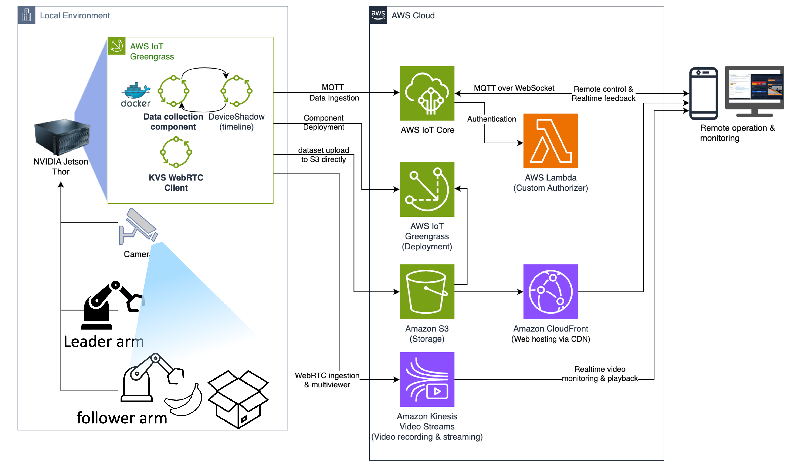

<div align="center">
  <h1>LeRobot Data Collection — AWS IoT Greengrass 컴포넌트</h1>
  <p>
    <a href="./README.md">English</a>
    ◆ <a href="./README-ko.md">한국어</a>
  </p>
</div>

> ⚠️ **중요 — 샘플 코드이며 프로덕션용이 아닙니다.** 이 코드는 교육 및 데모 목적의
> 샘플이며 **프로덕션 사용을 위한 것이 아닙니다**. 배포 전 보안·법무 팀과 협력하여
> 조직의 보안·규제·규정 준수 요구사항을 충족하고, 아래 **Known Limitations(알려진
> 제약)** 에 기술된 하드닝을 완료하세요. 라이선스는 MIT-0(`LICENSE` 참조)입니다.
> 이 콘텐츠를 배포하면 AWS 리소스가 생성되어 요금이 발생할 수 있습니다.

SO-ARM101(Leader/Follower) + 듀얼 카메라로 텔레오퍼레이션 데이터를 **LeRobot 포맷**으로
녹화하고 **Amazon S3**로 업로드하는 AWS IoT Greengrass v2 커스텀 컴포넌트
(`com.lerobot.data-collection`). 웹 UI에서 MQTT로 원격 제어합니다.

Jetson AGX Thor(JetPack 7 / CUDA 13, aarch64)에서 검증되었습니다.

> [!IMPORTANT]
> 이 저장소의 예제는 실험 및 교육 목적으로만 제공됩니다. 개념과 기법을 보여주기 위한 것이며
> 프로덕션 환경에서의 직접 사용을 의도하지 않습니다.

### 핵심 기능
- 🎮 **원격 제어** — 웹 콘솔에서 MQTT로 녹화 시작 / 저장·다음 / 세션종료 / 폐기 / 업로드
- 🎥 **실시간 모니터링** — 컬러 카메라 WebRTC 라이브(+ 방화벽 안전 HLS 폴백), 영상에 디바이스 시각(HH:MM:SS) 오버레이
- 🎞 **에피소드 재생** — 세션·에피소드별 구간을 KVS에서 HLS로 다시보기(Device Shadow 기반)
- 📦 **자동 업로드** — LeRobot v3.0 데이터셋을 S3로(날짜/지시어/세션 구조), 완료본은 presigned URL 재생·다운로드
- 🗂 **파일 브라우저** — 업로드 상태 확인 · 미업로드분 재업로드 · 다운로드
- 🧱 **자체 완결 이미지** — 컴포넌트 install이 디바이스에서 데이터수집 Docker 이미지를 처음부터 빌드(추론 베이스 무의존)

## Demo Video
  
https://github.com/user-attachments/assets/ffb4a431-67ce-44cd-9650-570edc4c581c


## 아키텍처



<details>
<summary>텍스트 다이어그램</summary>

```
┌───────────────────────────────────────────────────────────────────┐
│  🌐  Web 콘솔  (CloudFront + MQTT over WSS, Custom Authorizer 로그인)│
│      제어 · 상태 · 라이브 영상 · 에피소드 재생 · 파일 브라우저          │
└──────────────┬─────────────────────────────────┬──────────────────┘
       MQTT 명령·상태·Shadow                 WebRTC / HLS 영상
               │                                 │
┌──────────────▼──────────────┐     ┌────────────▼──────────────────┐
│  ☁️  AWS IoT Core            │     │  ☁️  Kinesis Video Streams     │
│     Custom Authorizer 인증   │     │     라이브(WebRTC) · 재생(HLS)  │
│     Device Shadow: episodes  │     └────────────▲──────────────────┘
└──────────────┬──────────────┘                  │ 컬러 영상 ingest
               │ Greengrass IPC                   │
┌──────────────▼──────────────────────────────────┴─────────────────┐
│  🤖  Greengrass Core — Jetson AGX Thor                             │
│   ┌───────────────────────┐    ┌──────────────────────────────┐   │
│   │ collect.py            │    │ com.groot.kvs-webrtc-ingest  │   │
│   │  · MQTT 제어/진행상황  │    │  · 컬러캠 → H.264 → KVS       │   │
│   │  · docker run lerobot │    │  · 디바이스 시각 오버레이       │   │
│   │  · S3 업로드/presign   │    │  · 뷰어 STS 크레덴셜 발급        │   │
│   │  · 에피소드 shadow     │    └──────────────────────────────┘   │
│   └──────────┬────────────┘                                        │
│              │ docker      SO-101 팔(/dev/ttyACM0·1)               │
│   ┌──────────▼──────────────────────────┐  듀얼 카메라(/dev/cam_*) │
│   │ 🐳 lerobot-record (self-built image) │                         │
│   └──────────────────────────────────────┘                        │
└───────────────────────────────┬───────────────────────────────────┘
                     boto3 업로드 (LeRobot v3.0)
                                 │
┌───────────────────────────────▼───────────────────────────────────┐
│  🪣  Amazon S3 — datasets/{date}/{slug}/{session}/                  │
│      data/*.parquet · videos/observation.images.*/*.mp4 · meta/*   │
└────────────────────────────────────────────────────────────────────┘
```

</details>

- **제어/데이터 평면 분리**: 명령·상태·에피소드 window(Shadow)는 IoT Core, 데이터셋은 S3, 실시간·다시보기 영상은 KVS로 각각 흐릅니다.
- **영상 2경로**: 데이터셋 mp4(정확한 학습 데이터)와 KVS 스트림(모니터링/다시보기)은 별도 파이프라인입니다.

## 구성

```
.
├── components/com.lerobot.data-collection.gpu/recipe.yaml  # NVENC 인코딩 변형 recipe
├── components/com.lerobot.data-collection.v21/recipe.yaml  # LeRobot dataset v2.1(에피소드별) 변형 recipe
├── components/com.lerobot.data-collection.v21/artifacts/collect.py  # v21 collect.py (폐기=재녹화, 리셋 카운트다운, recSeq)
├── components/com.lerobot.data-collection.v21.gpu/recipe.yaml  # v2.1 + 실제 GPU(NVENC) 인코딩 변형 recipe
├── components/com.lerobot.data-collection.v21.gpu/artifacts/collect.py  # v21.gpu collect.py (.v21과 동일한 컨트롤러)
├── components/com.lerobot.data-collection/recipe.yaml   # 원본/레퍼런스 recipe (이미지 self-build)
├── components/com.lerobot.data-collection/artifacts/collect.py      # 컨트롤러 (MQTT 제어 · 녹화 · S3 업로드 · 에피소드 shadow)
├── components/com.lerobot.data-collection.gpu/artifacts/collect.py  # NVENC 변형용 복사본 (동일 컨트롤러)
├── components/com.groot.kvs-webrtc-ingest/recipe.yaml   # (선택) 컬러 카메라 → KVS WebRTC 라이브/에피소드 재생 소스
├── components/com.groot.kvs-webrtc-p2p/recipe.yaml      # (선택) 저지연 P2P 라이브 + kvssink 녹화(tee) — kvs-webrtc-ingest의 <1초 대안
├── web-ui/multiviewer.html                              # 멀티뷰어 콘솔 (KVS storage 뷰어; 클라우드 팬아웃 최대 3뷰어, 디바이스 무관)
├── web-ui/live-p2p.html                                 # 저지연 P2P 라이브 콘솔 (기본 랜딩; <1초)
├── infra/cloudformation.yaml                            # IoT Custom Authorizer + CloudFront + S3
├── Dockerfile.data-collection-minimal(.md)              # 데이터 수집용 최소 이미지 레퍼런스 (recipe 인라인 빌드가 미러링)
├── deploy.sh                                            # 전체 배포 스크립트
└── README.md / DEPLOYMENT_GUIDE.md / AGENTS.md / COMPONENT_ARCHITECTURE.md / design.md  # 문서
```

---

## ⚠️ 배포 전에 반드시 치환해야 하는 플레이스홀더

이 저장소는 공개용으로 **민감/환경 고유 값을 플레이스홀더로 치환**해 두었습니다.
아래 값을 본인 환경에 맞게 바꾼 뒤 배포하세요.

| 플레이스홀더 | 의미 | 나타나는 파일 |
|---|---|---|
| `<AWS_ACCOUNT_ID>` | AWS 계정 12자리 ID | `components/.../recipe.yaml`(데이터수집 + `kvs-webrtc-ingest`의 `viewerRoleArn`), `components/.../artifacts/collect.py`, `infra/cloudformation.yaml`*, `web-ui/*.html`, `COMPONENT_ARCHITECTURE.md` |
| `<IOT_ENDPOINT>` | AWS IoT Core ATS 데이터 엔드포인트 (`xxxx-ats.iot.<region>.amazonaws.com`) | `web-ui/*.html` |
| `<WEB_USERNAME>` | 웹 콘솔 로그인 사용자명 | `web-ui/*.html`, `infra/cloudformation.yaml`, 문서 |
| `<WEB_PASSWORD>` | 웹 콘솔 로그인 비밀번호 | `web-ui/*.html`, `infra/cloudformation.yaml`, 문서 |
| `<DATA_BUCKET>` | 데이터셋 업로드 S3 버킷 (배포 리전과 **동일 리전** 권장 — presign 불일치 방지) | `web-ui/*.html`(#bk 기본값), 배포 config `s3Bucket` |

\* `<AWS_ACCOUNT_ID>`는 S3 버킷 이름(`greengrass-datasets-<AWS_ACCOUNT_ID>`) 등에 사용됩니다.
   본인 버킷 이름 규칙에 맞게 조정하세요.

### 엔드포인트 확인 방법
```bash
aws iot describe-endpoint --endpoint-type iot:Data-ATS \
  --query endpointAddress --output text --region <REGION>
```

### 일괄 치환 예시 (배포 전 로컬에서)
```bash
# macOS 기준 (Linux는 sed -i 사용)
grep -rl '<AWS_ACCOUNT_ID>' . | xargs sed -i '' 's/<AWS_ACCOUNT_ID>/123456789012/g'
sed -i '' 's/<IOT_ENDPOINT>/xxxxxxxxxxxxx-ats.iot.ap-northeast-2.amazonaws.com/g' web-ui/*.html
# 웹 자격증명은 web-ui/*.html 과 infra/cloudformation.yaml 양쪽을 동일하게 맞춰야 합니다.
```

### 🔐 보안 주의
- `<WEB_USERNAME>`/`<WEB_PASSWORD>`는 **`web-ui/*.html`과 `infra/cloudformation.yaml`
  (Custom Authorizer Lambda)에 동일하게** 설정해야 로그인이 동작합니다.
- 원본 데모는 `admin`/`admin`을 기본값으로 사용했습니다. **운영 환경에서는 반드시 강력한
  값으로 변경**하고, 가능하면 CloudFormation 파라미터/Secrets Manager로 관리하세요.
- IoT Custom Authorizer는 `base64(username:password)` 토큰을 검증합니다.

---

## Known Limitations (알려진 제약 · Demo/POC)

> ⚠️ 이 저장소는 교육·데모용 샘플이며 **프로덕션 준비 상태가 아닙니다**. 아래
> 항목은 데모 목적상 수용된 트레이드오프이며, 프로덕션 배포 전 반드시 조치하세요.

| 항목 | 현재 상태 | 프로덕션 조치 |
|------|-----------|----------------|
| WAF / CSP / 로깅 | CloudFront에 WAF·액세스 로깅·보안 응답 헤더(CSP/HSTS) 미적용 | AWS WAF(`AWSManagedRulesCommonRuleSet`, CLOUDFRONT 스코프는 us-east-1) 연결, 액세스 로깅 + CloudTrail 활성화, `ResponseHeadersPolicy`(CSP/HSTS) 추가 |
| 컨테이너 권한 | 모든 컴포넌트가 `RequiresPrivilege: true`, 레코더는 `docker run --network=host --runtime=nvidia` + 디바이스 패스스루로 실행 | 로봇/카메라 HW 접근에 필요. 필요한 포트/디바이스만 노출하고 non-root 실행 검토 |
| CDN 스크립트(SRI) | 웹 UI가 mqtt.js / hls.js / aws-sdk / kvs-webrtc를 공개 CDN에서 SRI 없이 로드 | 각 `<script>`에 `integrity`(SHA-384) + `crossorigin` 추가 또는 검증된 자산 자체 호스팅 |
| 의존성 고정 | `uv`를 파이프 설치 스크립트로 설치(체크섬 없음), KVS WebRTC SDK는 미고정 클론, `collect.py`가 런타임에 미고정 pip 설치(torch/lerobot은 **고정됨**) | 버전 고정 + 체크섬 검증, SDK 태그/커밋 고정, 런타임 `pip install`을 이미지 빌드로 이동 |
| presigned / HLS URL | MQTT로 전달, 만료를 1h로 단축(기존 12h) | 필요한 최소(예: ≤15분)로 추가 단축하고 구독 가능 대상을 제한 |
| 뷰어 STS 자격증명 | 단기 VIEWER STS 자격증명을 **retained** MQTT 토픽으로 게시 | 구독 정책을 좁히고(아래 필수 하드닝) 세션 지속시간 최소화 |
| 카메라 영상 | 컬러 카메라 영상이 KVS로 스트리밍되고 S3에 저장됨 | 사람이 촬영되면 동의를 확보하고 개인정보/보존 의무를 준수 |

> ⚠️ **프로덕션 배포 전 필수 하드닝 (면책 문구로 대체 불가):**
> - IoT Custom Authorizer 정책을 `Resource: "*"`에서 특정 client/topic ARN으로 제한
> - 데모 `admin/admin` 기본값 제거, 자격증명을 CloudFormation `NoEcho` 파라미터/Secrets Manager로 관리(가능하면 Amazon Cognito, Authorization Code + PKCE)
> - 데이터 버킷에 S3 Block Public Access · 기본 암호화 · TLS 강제 버킷 정책 · 버전 관리 적용
> - 디바이스/뷰어 IAM 역할을 `kinesisvideo:*`에서 특정 채널/스트림 ARN 및 viewer 전용 액션으로 축소

---

## 배포 개요

리전 기준값은 `ap-northeast-2`입니다. 필요 시 스크립트/문서의 리전을 변경하세요.

1. **플레이스홀더 치환** (위 표 참고)
2. **CloudFormation 배포** — `infra/cloudformation.yaml` (IoT Authorizer, S3, CloudFront)
3. **collect.py 업로드** — `s3://<데이터버킷>/collect/com.lerobot.data-collection/<version>/collect.py`
   (recipe의 fetch 경로 버전과 **동일 버전**으로 업로드)
4. **컴포넌트 등록** — `recipe.yaml`로 `create-component-version`
5. **Greengrass 배포** — 대상 thing/thing group에 `com.lerobot.data-collection` 추가
   (config: `thingName`, `s3Bucket`, `episodeLength`, `numEpisodes` 등)

**배포 명령어·설정값 상세는 `DEPLOYMENT_GUIDE.md`** 를 참고하세요. 배경/구조는 `COMPONENT_ARCHITECTURE.md`, `design.md`, `AGENTS.md`.

> 컴포넌트 install 단계가 디바이스에서 데이터 수집용 Docker 이미지를 **처음부터 빌드**합니다
> (aarch64 torch + torchcodec(소스 빌드) + cuDSS + lerobot 등). 베이스 이미지는 공개
> `nvidia/cuda:13.0.x-cudnn-devel-ubuntu24.04`(Jetson Thor 검증)를 사용합니다.

## 사용 시나리오

### 시나리오 A — 멀티 에피소드 수집 세션 (기본 흐름)
1. **로그인** — CloudFront 웹 콘솔을 열고 `<WEB_USERNAME>`/`<WEB_PASSWORD>`로 연결. 라이브 화면 2종: **`live-p2p.html`**(기본 랜딩, <1초 P2P) / **`multiviewer.html`**(KVS storage 뷰어; 클라우드 팬아웃 최대 3뷰어, 디바이스 무관). 아래 "라이브 화면 선택" 참고.
2. **라이브 확인** — 우측 *Monitor* 탭 `WebRTC Live`에서 작업 공간 컬러 영상(우하단 디바이스 시각) 확인.
3. **녹화 시작** — *Control*에서 지시어(예: `pick orange`) + 에피소드 수 입력 → **⏺ 녹화 시작**.
   상태 뱃지가 `recording`, 화면·로그에 `start episode 1`.
4. **에피소드 진행** — 시연 1회 끝나면 **⏭ 저장 & 다음**(현재 에피소드 저장 후 다음으로).
   또는 그냥 두면 `episodeLength` 초 후 **자동 전환**(로그 `[TIMEOUT]`). 매 전환마다 `start episode N`.
5. **세션 종료** — 목표 수 도달 또는 **🟥 세션 종료**(endSession) → 상태 `saving`→`uploading`→`done`.
   데이터셋이 `s3://<DATA_BUCKET>/datasets/{날짜}/{지시어}/{세션}/`에 적재.
6. **다시보기** — *Monitor* → `Episode Playback`에 방금 세션의 Episode 1·2·3…이 뜸(Device Shadow).
   클릭하면 그 구간을 `thor-001-webrtc`에서 HLS로 재생(컬러 + 타임스탬프).

### 시나리오 B — 방화벽 환경(사내망)에서 라이브 보기
- WebRTC(UDP/STUN·TURN)가 막혀 `WebRTC Live`가 안 뜨면, *Monitor* 상단 토글에서 **`HLS Live`** 선택.
  같은 `thor-001-webrtc` 스트림을 HLS(TCP/443)로 재생 → 방화벽 뒤에서도 영상 확인(수 초 지연).

### 시나리오 C — 과거 데이터 검토 & 다운로드
1. *Files* 탭에서 **날짜 + 지시어** 입력 → **🔄 List**로 세션/파일 목록 조회(업로드 배지 표시).
2. 세션 폴더(📁) 옆 **▶** → *Monitor*가 `Episode Playback`으로 전환되고 세션 전체 구간 설정 + 에피소드 목록 표시.
3. 왼쪽 **Episode N ▶** 클릭 → 그 에피소드 시간대만 재생.
4. 개별 mp4는 **⬇️** 로 다운로드(presigned URL, 배포 리전 일치 시 정상).

### 시나리오 D — 부분 업로드 복구 / 재업로드
- 네트워크 문제 등으로 일부 파일이 미업로드면, *Files*에서 **미업로드 파일 선택 → 재업로드**.
- 마지막 에피소드가 0프레임으로 실패(exit 133)해도, 이미 저장된 에피소드는 **자동으로 마무리·업로드**되고
  Shadow에도 반영됩니다(세션 전체가 버려지지 않음).

> 명령은 모두 `web-ui`가 `lerobot/<thing>/collect/command`로 MQTT publish합니다. CLI로도 트리거 가능(→ `DEPLOYMENT_GUIDE.md` §11).

## 데이터 포맷 (LeRobot)
```
{repo_id}/
├── data/chunk-000/*.parquet      # observation.state, action, timestamp, index
├── videos/observation.images.{front,wrist}/chunk-000/*.mp4
└── meta/{info.json, stats.json, tasks.parquet, episodes/*}
```

---

## (선택) 라이브 영상 모니터링 — `com.groot.kvs-webrtc-p2p` 또는 `com.groot.kvs-webrtc-ingest`

녹화 완료본은 S3 presigned URL로 재생하지만, **녹화 중 실시간 영상**을 보려면 지연이 큽니다.
두 선택 컴포넌트가 **컬러 카메라 → Amazon Kinesis Video Streams(KVS) WebRTC**로 라이브 영상을
제공합니다(둘 다 에피소드별 HLS 다시보기 유지). **하나만** 사용하세요(둘 다 같은 컬러 카메라 점유):

- **`com.groot.kvs-webrtc-p2p`** — **P2P, <1초** 라이브(디바이스 → 브라우저 직결), `kvssink` tee로
  녹화 유지. 채널당 **최대 10 뷰어**이나 **디바이스 CPU/uplink에 한계**. **저지연 운영 모니터**에 최적.
  웹 페이지: **`live-p2p.html`**(기본 배포 세트가 이걸 사용).
- **`com.groot.kvs-webrtc-ingest`** — **storage 세션** 라이브(디바이스 → KVS 클라우드 → 브라우저,
  ~2~5초+). KVS 클라우드가 **multiviewer quota(3 뷰어)** 까지 팬아웃하며 **디바이스 리소스와 무관**.
  웹 페이지: **`multiviewer.html`**.

> **시나리오:** 로봇을 가까이서 보는 저지연 모니터 → **`kvs-webrtc-p2p`(`live-p2p.html`)**; 디바이스
> 부하와 무관한 클라우드 팬아웃(최대 3 뷰어) → **`kvs-webrtc-ingest`(`multiviewer.html`)**. 상세
> 트레이드오프 표는 각 컴포넌트 README 참고.

이 섹션의 이하 내용은 storage 변형(`kvs-webrtc-ingest`) 기준입니다. P2P 변형은
[`components/com.groot.kvs-webrtc-p2p/README.md`](components/com.groot.kvs-webrtc-p2p/README.md) 참고.

- **동작**: GStreamer로 컬러 카메라를 H.264 인코딩 → KVS WebRTC **STORAGE** 마스터 샘플이
  `JoinStorageSession`으로 시그널링 채널에 media를 ingest → 브라우저가 WebRTC **뷰어**로 시청.
- **카메라 자동 탐색**: `videoDevice`가 비어 있으면 **YUYV(컬러)** 를 내보내는 v4l2 노드를 자동 선택
  (IR/GREY 노드는 배제). RealSense 컬러 노드는 v4l2 raw 캡처가 불안정할 수 있어, 환경에 따라
  `videoDevice`를 명시하거나 install 스크립트의 소스 노드를 조정해야 할 수 있습니다.
- **웹 뷰어 자격증명 전달**: 브라우저에는 AWS 자격증명이 없으므로, 디바이스가 **단기(1시간)·뷰어
  전용 STS 자격증명**(`AssumeRole KvsViewerRole`)을 발급해 MQTT(`lerobot/{thing}/webrtc/viewer`,
  retained)로 전달합니다. 브라우저는 이 자격증명으로 `joinStorageSessionAsViewer`를 호출합니다.

### 사전 준비 (KVS)
1. **시그널링 채널 + MediaStorageConfiguration** 생성 (채널→동일 이름 스트림, storage ENABLED).
2. **뷰어 IAM 역할** `KvsViewerRole` 생성 — `recipe.yaml`의 `viewerRoleArn`에 지정
   (`arn:aws:iam::<AWS_ACCOUNT_ID>:role/KvsViewerRole`). **최소 권한**(해당 채널에 대한
   `kinesisvideo:GetSignalingChannelEndpoint`, `ConnectAsViewer`, `DescribeSignalingChannel`,
   `GetIceServerConfig` 등 viewer 범위만) 으로 제한하세요.
3. 디바이스 TES Role에 `kinesisvideo:*`(또는 ingest에 필요한 최소 액션) + 해당 채널에 대한
   `sts:AssumeRole`(KvsViewerRole) 권한.

### 🔐 보안 주의 (공개 배포 시)
- `viewerRoleArn`의 계정 ID는 **`<AWS_ACCOUNT_ID>` 플레이스홀더**로 치환돼 있습니다 — 본인 계정으로 교체.
- 뷰어 자격증명이 **MQTT retained**로 게시됩니다. 해당 토픽 구독은 반드시 **Custom Authorizer로 인가**된
  클라이언트만 가능하도록 IoT 정책을 좁히세요(만료 전까지 마지막 메시지가 토픽에 남습니다).
- `KvsViewerRole`은 **읽기(viewer) 권한만** 갖도록 최소화하고, 세션 지속시간(기본 3600초)도 필요 최소로.
- 이 recipe에는 **하드코딩된 AWS 키가 없습니다**(TES + STS 런타임 발급). 커밋 전에도 키를 넣지 마세요.

### 등록/배포 (요약)
```bash
# 채널/역할 준비 후
aws greengrassv2 create-component-version \
  --inline-recipe fileb://components/com.groot.kvs-webrtc-ingest/recipe.yaml --region <REGION>
# 배포 config 예: {"channelName":"<채널>","thingName":"<thing>","videoDevice":"","viewerRoleArn":"arn:aws:iam::<AWS_ACCOUNT_ID>:role/KvsViewerRole"}
```

---

## 이 폴더에서 제외된 것 (업로드 비대상)
공개 업로드를 위해 아래는 이 폴더에 **포함하지 않았습니다** (원본 `collection-web`에 존재):
- `test/` — 다운로드한 데이터셋 샘플(대용량 mp4/parquet)
- `artifacts/__pycache__/` — 파이썬 캐시
- `deploy-history.md`, `progress.md` — 계정ID/프로필/Job ID 등이 담긴 내부 운영 기록

`.gitignore`가 위 유형(대용량 데이터·캐시·OS 파일)을 재발 방지합니다.

---

## 구성 컴포넌트 & 기능

이 샘플에 포함된 컴포넌트와 기능입니다(민감값은 플레이스홀더).

### 컴포넌트 (녹화 + 라이브 모니터링)
| 컴포넌트 | 버전 | 역할 |
|---|---|---|
| `com.lerobot.data-collection` | 1.0.0 | CPU(SVT-AV1) 영상 인코딩 데이터 수집 레시피 — 레퍼런스 변형 |
| `com.lerobot.data-collection.gpu` | 1.0.0 | NVENC ffmpeg shim 적용 데이터 수집 레시피(GPU 인코딩 시도, 실패 시 CPU 폴백); `collect.py`는 버전 폴더에서 재사용 |
| `com.lerobot.data-collection.v21` | 1.0.0 | **lerobot v0.3.3** 고정 → **LeRobot dataset v2.1(에피소드별 개별 파일:** `data/chunk-000/episode_000000.parquet`, `videos/chunk-000/<key>/episode_000000.mp4`**)** 생성. 전용 `collect.py`로 **폐기(Discard)=현재 에피소드 재녹화**(세션 전체 종료 아님), 리셋 구간 카운트다운, `recSeq` 실시간 녹화시작 신호 추가 |
| `com.lerobot.data-collection.v21.gpu` | 1.0.0 | v2.1(에피소드별) + **실제 GPU(NVENC) 영상 인코딩**. 이미지가 lerobot `encode_video_frames`를 **시스템 `ffmpeg` CLI + `h264_nvenc`** 로 인코딩하도록 패치(실패 시 원본 PyAV/CPU SVT-AV1로 폴백). Jetson Thor에서 CPU 대비 **약 2.7배 빠름** ([GPU_ENCODING.md](GPU_ENCODING.md) 참고). 전용 `collect.py` 포함(`.v21`과 동일한 컨트롤러) |
| `com.groot.kvs-webrtc-ingest` | 1.0.0 | 컬러 카메라 → KVS WebRTC ingestion(라이브/에피소드 재생 소스 `thor-001-webrtc`). clockoverlay로 디바이스 시각(HH:MM:SS) 굽기 + 뷰어 STS 크레덴셜 발급 |
| `com.groot.kvs-webrtc-p2p` | 1.0.0 | 컬러 카메라 → 단일 캡처를 tee로 분기: KVS WebRTC **P2P** master(`thor-001-p2p`, <1초 라이브) + `kvssink` 녹화(`thor-001-webrtc`, HLS 재생). `kvs-webrtc-ingest`의 저지연 대안 |

> `.gpu`는 `collect.py`를 별도로 패키징하지 않고 원본 경로
> `s3://greengrass-datasets-<AWS_ACCOUNT_ID>/collect/com.lerobot.data-collection/<ver>/collect.py`
> 를 런타임에 fetch합니다. `.v21`과 `.v21.gpu`는 각자 컴포넌트 전용 경로
> (`s3://greengrass-datasets-<AWS_ACCOUNT_ID>/collect/com.lerobot.data-collection.v21/<ver>/collect.py`
> 와 `.../collect/com.lerobot.data-collection.v21.gpu/<ver>/collect.py`; 두 스크립트는 동일)를 fetch합니다. **레시피의 fetch 경로 버전과 collect.py 업로드 버전을 반드시 일치**시키세요.
> 네 데이터수집 컴포넌트는 동일 MQTT 토픽을 쓰므로 **둘 이상 동시에 켜지 말 것**(택1). `com.lerobot.data-collection`/`.gpu`는 v3.0(패킹) 포맷, `.v21`/`.v21.gpu`는 v2.1(에피소드별) 포맷을 만듭니다.
>
> **GPU 인코딩 주의:** `.gpu`의 NVENC *ffmpeg shim*은 실제로 **동작하지 않습니다** — 이 lerobot 버전은 `ffmpeg` CLI가 아니라 **PyAV로 in-process 인코딩**하므로 shim이 안 걸리고 `.gpu`도 CPU AV1을 출력합니다. `.v21.gpu`는 lerobot 인코더가 시스템 `ffmpeg` CLI(`h264_nvenc`)를 직접 호출하도록 패치해 이 문제를 해결한, **실제 GPU 인코딩(H.264)** 변형입니다. [GPU_ENCODING.md](GPU_ENCODING.md) 참고.

### collect.py 주요 기능
- MQTT 제어: `start` / `stop`(현재 에피소드 저장 후 다음) / `endSession`(세션 종료) / `discard` / `upload` / `list` / `uploadFiles` / `kvsLive` / `kvsEpisodes`.
- **FIFO 외부 제어**: 컨테이너 내부 lerobot `control_utils.py`에 FIFO 워처를 주입해 `next`/`stop`/`rerecord` 이벤트 전달.
- **빈 에피소드(exit 133) 방지**: `next`/`stop`은 현재 에피소드가 최소 ~1.5초 녹화된 뒤에만 전달(FIFO 재시도 루프 내부에서 매 쓰기 직전 재확인 → 에피소드 경계 재배달로 인한 0프레임 크래시 차단).
- **빈 마지막 에피소드 복구**: 마지막 에피소드가 0프레임으로 crash(rc=133)해도, 이미 저장된 에피소드가 있으면 세션을 마무리해 **S3 업로드 + shadow 갱신**(통째로 버리지 않음).
- **에피소드 전환 로그**: 각 에피소드 시작 시 `[START]`, 자동 타임아웃은 `[TIMEOUT]`, 수동 Stop&Save는 `[NEXT]`.
- **에피소드 window Device Shadow**: 세션 종료 시 각 에피소드의 `[start,end]`(wall-clock)를 named shadow `episodes`(reported)로 publish(boto3 `iot-data.update_thing_shadow`). 최신 세션만 유지. 웹 UI가 이를 읽어 `thor-001-webrtc`의 해당 구간을 HLS로 재생.
- **presign 견고화**: presigned URL을 **frozen credentials + SigV4**로 서명(TES 자격증명 갱신 중 서명 불일치 = SignatureDoesNotMatch 방지). 데이터 버킷은 **배포 리전과 동일 리전**이어야 presign이 유효.

### MQTT 토픽
- 명령/상태/영상/파일: `lerobot/{thing}/collect/{command,status,video,files,kvs}`
- 뷰어 STS 크레덴셜(retained): `lerobot/{thing}/webrtc/viewer`
- 에피소드 window shadow: `$aws/things/{thing}/shadow/name/episodes/{update,get,...}`
  (디바이스 TES 역할에 `iot:UpdateThingShadow` 필요; 웹은 Custom Authorizer로 shadow get/구독)

### 웹 UI (관리자 콘솔)
- 로그인(Custom Authorizer 토큰) → MQTT over WSS.
- 좌: Login/Control/Status/**Logs**, 우: **Files** / **Monitor**.
- **Monitor** 상단 토글(한 줄): `WebRTC Live` / `HLS Live` / `Episode Playback`.
  - WebRTC Live: `joinStorageSessionAsViewer`로 `thor-001-webrtc` 컬러 실시간(UDP).
  - HLS Live: 같은 스트림을 `GetHLSStreamingSessionURL(LIVE)`로(TCP/443, 방화벽 안전 폴백).
  - Episode Playback: 왼쪽 에피소드 목록(shadow) + 오른쪽 구간 재생(ON_DEMAND / 미래 범위는 LIVE_REPLAY).
- Files: 세션 폴더(📁) 옆 ▶ → 그 세션 전체 구간으로 설정 + 에피소드 목록에서 선택 재생. mp4 옆은 다운로드(⬇️)만.
- 상태 뱃지 idle/recording/saving/uploading/done/error + 에러 표시.

### 리전/버킷 주의
- 데이터 업로드 버킷은 **배포 리전과 동일 리전**에 두세요. 다른 리전(예: us-east-1) 버킷이면
  presigned URL 서명 리전 불일치로 다운로드/재생이 `AuthorizationQueryParametersError`로 실패합니다.
